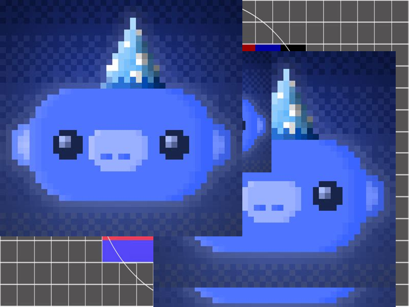

# pixelflut
> A pixel drawing game for programmers

Pixelflut provides a 2D pixel canvas upon which many people can competitively set single color values. 
It is inspired by Reddits [r/place](https://www.reddit.com/r/place) and [CCCGOE's Pixelflut](https://cccgoe.de/wiki/Pixelflut).



## Installation

Multiple implementations have been developed by me (mostly because it was fun) but the
most current one is the rust implementation.

### Install via cargo from source

This installation methods assumes you already have a working rust toolchain and a working
*cargo* command.
If you do you can run the following:

```bash
cargo install --git=https://github.com/ftsell/pixelflut.git --features=default,bin --bin=pixelflut
```

## Usage examples
- Retrieve command-line help

  ```bash
  pixelflut -h
  pixelflut server -h
  ```

- Start a pixelflut tcp server on port 1234 with default size and persisted in the file *~/pixmap.pixmap*
 
  ```bash
  pixelflut server --file ~/pixmap.pixmap --tcp 1234
  ```

- Start a pixelflut udp server on port 1234 with custom size and persisted in the file *~/pixmap.pixmap*

  ```bash
  pixelflut server --file ~/pixmap.pixmap --udp 1234 --width 10 --height 20
  ```

